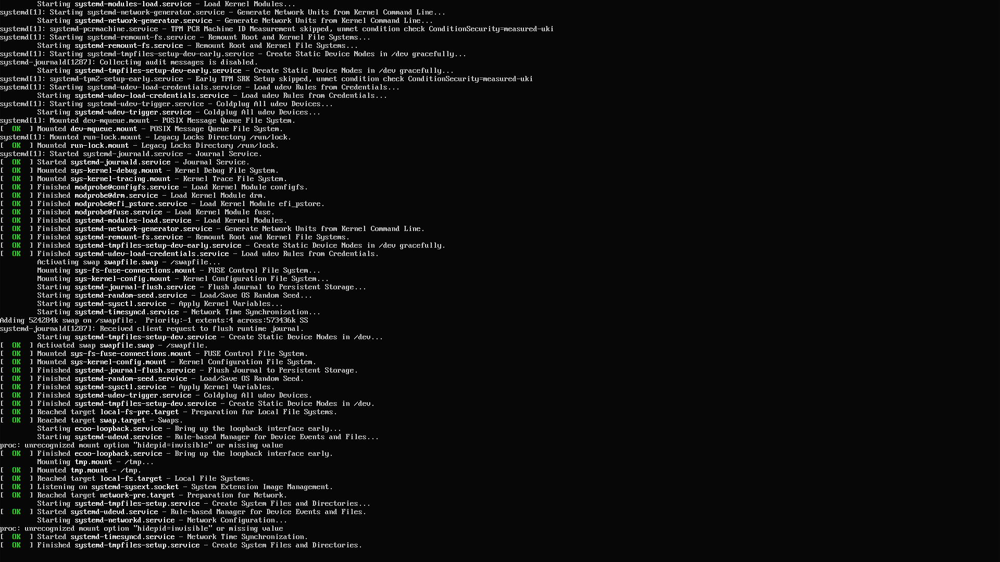
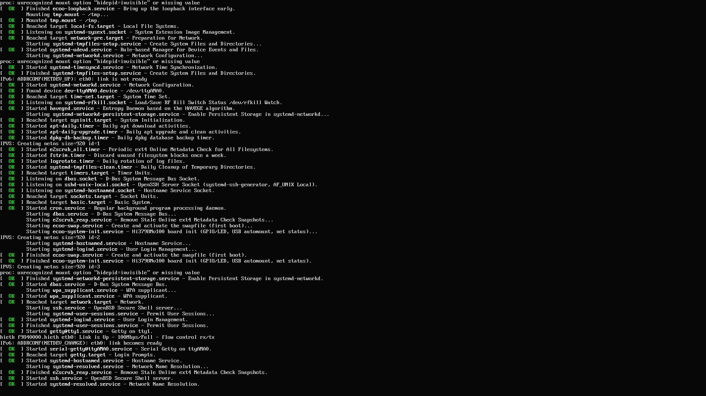

# TTL-hi3798mv100-32bit — 大内存版

**用途**：纯 Linux 服务器场景（SSH、容器、下载机、文件服务），
不需要硬件视频解码，希望尽量多留可用内存时使用。

## 一、系统说明

### 发行版与架构

| 项      | 值                                    |
| ------ | ------------------------------------ |
| 发行版    | Debian 13.7 (trixie)                 |
| 架构     | armhf（ARM 32 位，hard-float ABI）       |
| 处理器    | Hi3798Mv100（Cortex-A7）               |
| DDR    | 768M（fastboot 选用 `bootargs_768M` 档位） |
| 内核     | `4.4.35_ecoo_81082668`，厂商内核重编        |
| 已装软件包  | 192 个（166 个 armhf + 26 个 all）        |
| rootfs | ext4，镜像内 512 MiB，首次开机自动扩展到占满 eMMC    |

armhf 是 Debian 的官方支持架构，`deb.debian.org` 的 trixie 与 trixie-security
两个 Release 文件的 `Architectures` 字段都含 `armhf`，可直接使用官方源。

### 登录

| 方式   | 说明                                      |
| ---- | --------------------------------------- |
| HDMI | 开机后直接显示 tty1 的登录提示符（内核 fbcon 实现，非第三方程序） |
| 串口   | `ttyAMA0`，115200 8N1，同样有登录提示符           |
| SSH  | `sshd` 默认启用，走 22 端口                     |

两个本地终端对应 `getty@tty1.service` 与 `serial-getty@ttyAMA0.service`，
均已启用。HDMI 与串口显示的是同一个 tty1 和同一个 hostname。

默认账号 `root`，默认密码见随包说明，**建议首次登录后立即修改**。

### 实际效果

HDMI 上的实际画面：

开机 logo：

HDMI 上的 systemd 启动日志（原生 TTY，注意 swap 已正常启用）：

---

### hostname

镜像是 `histb`，首次开机会按 eMMC serial 推导成 `histb-<hex>` 的形式
（例如 `histb-6ede58ec`）。推导逻辑在 `/usr/local/sbin/ecoo-firstboot.sh`，
读取 `/sys/block/mmcblk0/device/serial`，读不到时依次退化为
`/proc/sys/kernel/random/uuid` 和时间戳。每台盒子各不相同。

### 内核命令参数

    model=mv100 console=ttyAMA0,115200 console=tty0 root=/dev/mmcblk0p9 \
    rootfstype=ext4 rootwait \
    blkdevparts=mmcblk0:1M(boot),1M(bootargs),4M(baseparam),4M(pqparam),\
    4M(logo),20M(kernel),64M(busybox),512M(backup),-(ubuntu) \
    mem=768M mmz=ddr,0,<offset>,<size> vmalloc=500M

`console=tty0` 是 HDMI 出现内核日志与登录提示符的关键。
`mmz` 的 offset 由 fastboot 按 mmz size 算出，两个版本取值不同，详见下文。

### 启用的服务

    multi-user.target : ecoo-fbconsole, ecoo-swap, ecoo-system-init, ssh,
                        systemd-networkd, systemd-resolved, wpa_supplicant,
                        e2scrub_reap, remote-fs.target
    sysinit.target    : ecoo-loopback, haveged, systemd-network-generator,
                        systemd-pstore, systemd-timesyncd
    getty.target      : getty@tty1, serial-getty@ttyAMA0
    timers.target     : apt-daily, dpkg-db-backup, e2scrub_all, fstrim, logrotate

`ecoo-fbconsole` 是在内核尚未支持 fbcon 时用的用户态兜底程序。
本固件的内核已开启 fbcon，该服务启动后会自动检测到并退出，不占资源。

### 软件与网络

预装 `openssh-server`、`curl`、`wget`、`nano`、`vim-tiny`、`cron`、
`ntfs-3g`、`dosfstools`、`fuse3`、`wpasupplicant`、`firmware-realtek`
（常见 USB 无线网卡固件）、`haveged`（熵源）。

网络由 `systemd-networkd` 管理，`/etc/network/interfaces` 未使用。
有线口默认 DHCP。无线可用 `wpa_supplicant`，但需自行配置。

apt 源为官方源，classic 格式写在 `/etc/apt/sources.list`：

    deb http://deb.debian.org/debian trixie main contrib non-free-firmware
    deb http://deb.debian.org/debian trixie-updates main contrib non-free-firmware
    deb http://deb.debian.org/debian-security trixie-security main contrib non-free-firmware

`ca-certificates` 与 `debian-archive-keyring` 已安装，
`/etc/apt/trusted.gpg.d/` 含 trixie 的 stable 与 security keyring，可直接换 https 源。

另有一项网络调优 `/etc/apt/apt.conf.d/99-ecoo-network-tuning`：
`Acquire::ForceIPv4 "true"`，避免这类盒子在只通告 IPv6 却没有实际路由的
路由器后面让 apt 卡在 IPv6 连接上。

### 磁盘与日志

镜像内 rootfs 占 512 MiB，已用约 292 MiB，空闲约 220 MiB。
首次开机会执行一次 `resize2fs` 把文件系统撑满 eMMC 分区，之后可用空间
取决于 eMMC 容量（实测机型可扩到约 6.8 GiB）。

journald 配置为 volatile（`/etc/systemd/journald.conf.d/00-ecoo-volatile.conf`），
日志写 `/run`，不落盘，避免小容量 eMMC 被日志撑满。

### 首次开机做了什么

1. `ecoo-resize-rootfs` 扩展根文件系统（带 360 秒超时保护，单次实测不足 1 秒）
2. `ecoo-firstboot` 推导 hostname、生成 machine-id 与 `/etc/first_init` 标记
3. `ecoo-swap` 创建 512 MiB `/swapfile` 并启用（`swapfile.swap` 在首次开机会
   先报一次 FAILED，属预期——fstab 条目在 `local-fs.target` 之前激活，
   而创建文件的 `ecoo-swap` 在其之后运行，随后会正常 swapon）

---

---

## 版本参数

    bootargs_768M=mem=768M mmz=ddr,0,0,48M vmalloc=500M

fastboot 会把 mmz 的 offset 字段改写为 `464M`，内核实际收到：

    mem=768M mmz=ddr,0,464M,48M vmalloc=500M

| 项           | 值         |
| ----------- | --------- |
| 内核 CMA      | 48 MiB    |
| 内核可用内存      | 673.7 MiB |
| VDEC 硬件解码   | **不可用**   |
| HDMI 原生 TTY | 正常        |

## 实测数据

    cma: Reserved 48 MiB at 0x1d000000
    Memory: 689864K/786432K available
    Console: switching to colour frame buffer device 240x67
    histb-6ede58ec login:

系统可以正常启动并到达 login，HDMI 正常显示 TTY，网络正常。
但 VDEC 初始化会失败（日志中可见）：

    ERROR-HI_VDEC: VDEC_AllocPreBuffer: VDH Alloc 0x9664000 failed
    FATAL-HI_VDEC: VDEC_DRV_Init: alloc pre buffer fail
    FATAL-HI_VDEC: VDEC_DRV_ModInit: Init drv fail!
    cma: alloc 38500 failed: -12

这不影响系统启动与日常使用，只是硬件视频解码不可用。

## 刷机

HiTool → 分区表选 `emmc_TTL-hi3798mv100-32.xml`（9 个分区全部 Sel="1"，全量刷写）。

## 为什么 VDEC 会失败

VDEC 预分配要 157,696,000 B（约 150.4 MiB）连续 CMA，
而 48M 档位只给 CMA 48 MiB，且其中已有约 29.3 MiB 固定占用，
最大连续空闲块仅 11.7 MiB，因此分配必然失败。

要 VDEC 可用请改用 `TTL-hi3798mv100-32bit-vdec` 版；代价是可用内存少约 172 MiB。
